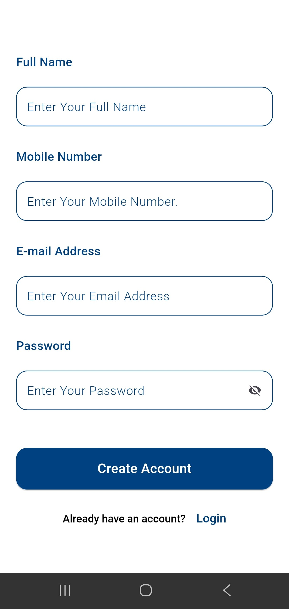
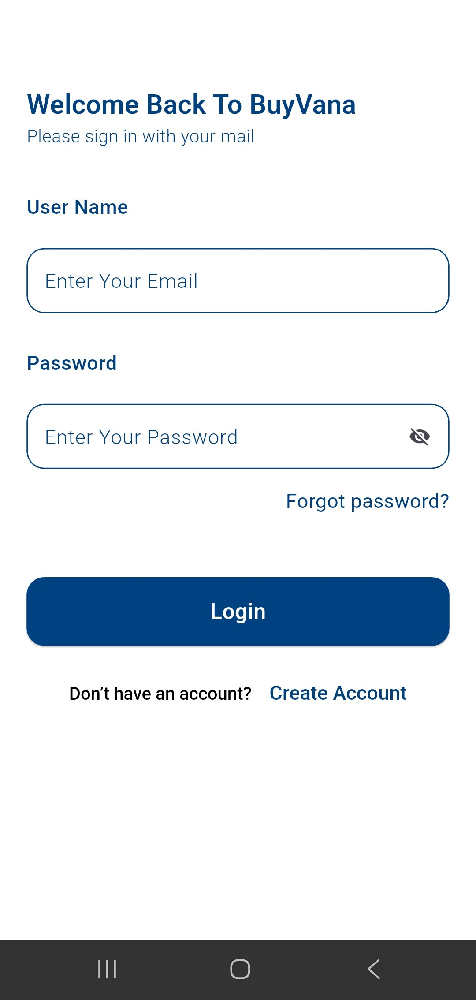
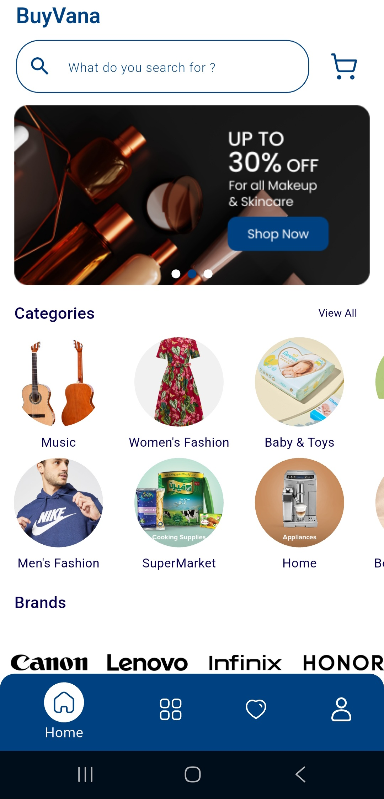
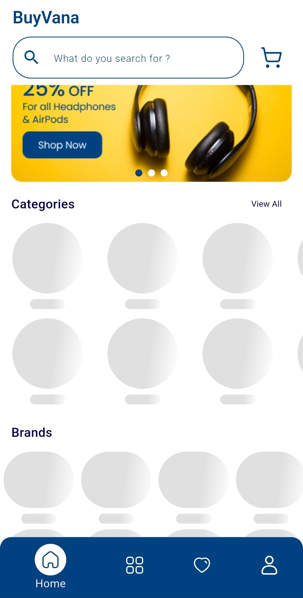
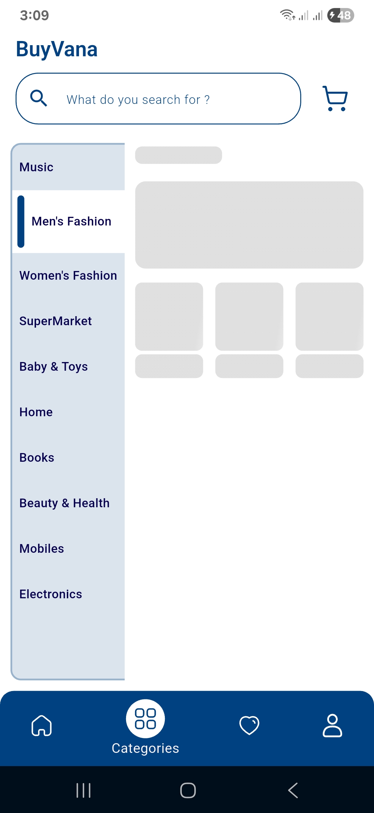
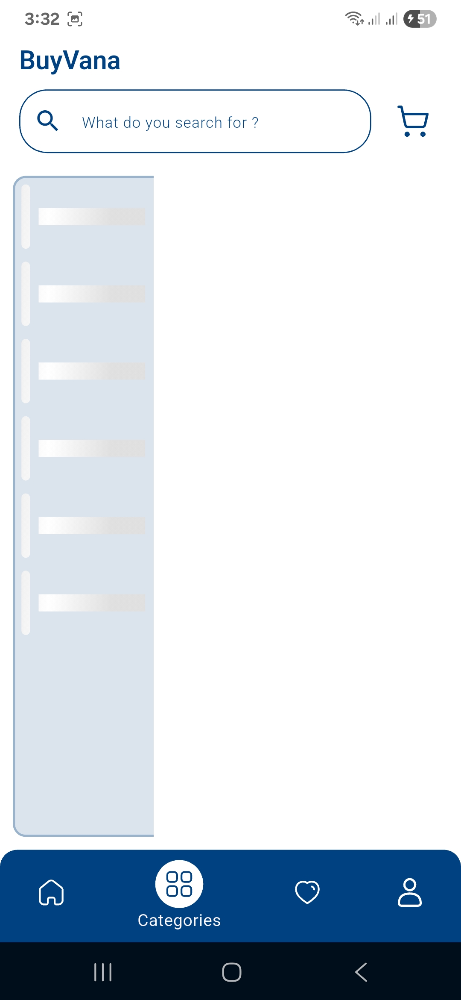
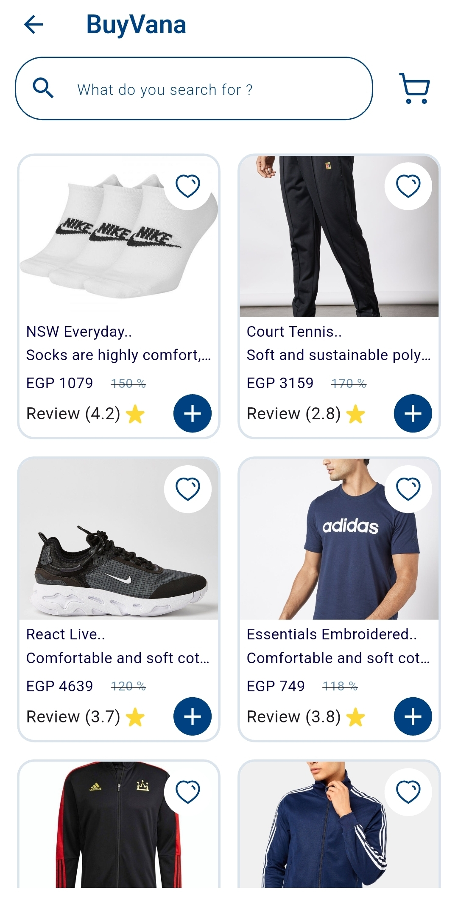

# BuyVana Store Shopping App
 BuyVana is a full-featured shopping app that allows users to browse products, add them to their cart,
 and complete purchases smoothly and efficiently.

## Technologies Used
- Clean Architecture for structured and maintainable code.
- Dependency Injection for managing app dependencies efficiently.
- Retrofit for API integration and network calls.
- JSON Serialization for parsing and handling JSON data effectively.
- Bloc for state management.
- Shimmer for optimized loading in HomeScreen And CategoriesScreen
- Cached Network Image  for optimized image loading.
- Flutter ScreenUtil for responsive UI design.
- 
## Features
- Authentication Sign up and Sign in using API integration.
- Browse products by category.
- Add products to the cart and manage quantities.
- Responsive and smooth user interface.
- State management using Bloc/Provider.
- Interactive UI with animations and Shimmer effects.

## App Screenshots

### Splash Screen

### SignUp Screen

### SignIn Screen 

### HomeTap Screen

### HomeTap for Loading with Shimmer Screen  

### CategoriesTap Screen

### CategoriesTap for Loading with Shimmer Screen

### Product Screen

### Product for Loading  Screen

